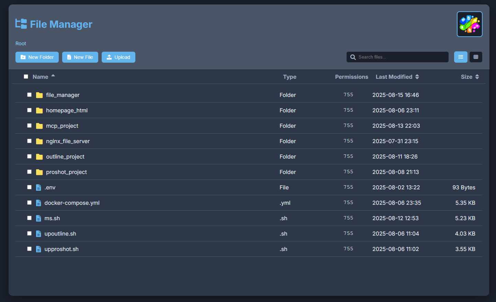
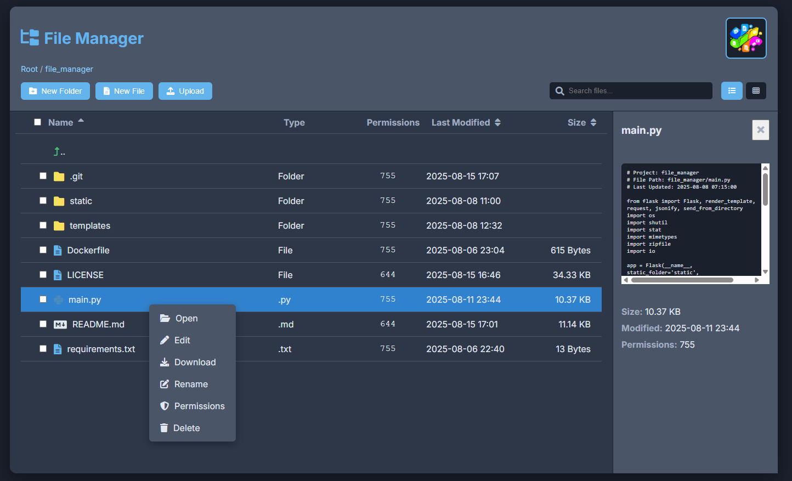
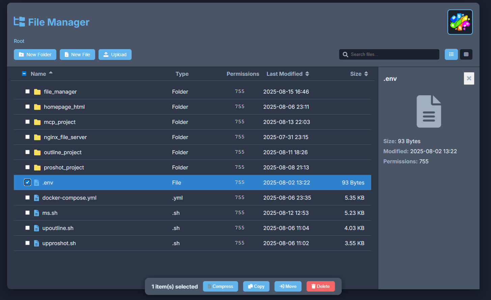

### **README.md**

# Web-Based File Manager

A modern, feature-rich, and intuitive web-based file manager built with Flask and vanilla JavaScript. This project provides a complete solution for managing files and folders through a beautiful and responsive user interface, packed with advanced features to enhance productivity.

-----

### ✨ Features

This file manager is more than just a file list. It's a complete workspace with professional-grade features:

  * **📁 Full CRUD Operations**: Create, read, update, and delete files and folders.
  * **🖼️ Dual View Modes**: Switch seamlessly between a detailed **List View** and a visual **Grid View**.
  * **🚀 Drag & Drop Upload**: Simply drag files from your desktop and drop them anywhere in the window to upload.
  * **🔍 Instant Search & Sort**: Find files instantly with the live search filter and sort items by name, size, or modification date.
  * **👁️ Advanced Preview Panel**: Preview images, text files (`.py`, `.txt`, `.js`), and the first page of PDF documents.
  * **🎬 Professional Media Viewers**:
      * **PDF Viewer**: Open and navigate through multi-page PDF documents in a dedicated viewer.
      * **Media Player**: Play audio and video files directly in the browser.
  * **📦 Archive Management**:
      * **Compress**: Select multiple files/folders and compress them into a single `.zip` archive.
      * **Extract**: Unzip archives directly on the server.
  * **⌨️ Keyboard Shortcuts**: Navigate and manage files faster with keyboard shortcuts (`Delete`, `F2`, `Enter`, `Arrow Keys`, etc.).
  * **🎨 Modern UI/UX**: A clean, dark-themed, and responsive interface built for an excellent user experience.
  * **🔒 Secure & Sandboxed**: All file operations are restricted to a designated root directory to prevent security risks.

-----

### 🛠️ Technology Stack

  * **Backend**: Python with Flask Framework
  * **Frontend**: Vanilla JavaScript (ES6+), HTML5, CSS3
  * **Code Editor**: CodeMirror for in-browser file editing.
  * **PDF Viewer**: PDF.js for rendering PDF documents.

-----

### 🚀 Installation and Setup

Follow these steps to get the project running on your local machine.

#### **Prerequisites**

  * Python 3.6+
  * pip (Python package installer)

#### **1. Clone the Repository**

```bash
git clone https://github.com/shishehgar/WebBase-FileManager.git
cd WebBase-FileManager
```

#### **2. Create and Activate a Virtual Environment**

It's highly recommended to use a virtual environment to manage project dependencies.

  * **On macOS/Linux:**
    ```bash
    python3 -m venv venv
    source venv/bin/activate
    ```
  * **On Windows:**
    ```bash
    python -m venv venv
    .\venv\Scripts\activate
    ```

#### **3. Install Dependencies**

Install all the required Python packages using the `requirements.txt` file.

```bash
pip install -r requirements.txt
```

#### **4. Project Structure**

Ensure your project has the following structure. Create the `static/images` and `files` directories if they don't exist.

```
/WebBase-FileManager
|-- /files                # Root directory for user files (created automatically)
|-- /static
|   |-- /css
|   |   `-- style.css
|   |-- /js
|   |   `-- app.js
|   `-- /images
|       `-- logo.png      # Place your logo here
|-- /templates
|   `-- index.html
|-- main.py
`-- requirements.txt
```

#### **5. Run the Application**

Execute the `main.py` script to start the Flask development server.

```bash
python main.py
```

The application will be running at `http://127.0.0.1:5006`. Open this URL in your web browser.

-----

### 📖 How to Use

#### **Main Interface**

  * **File Listing Area**: The central part of the screen where you see your files and folders.
  * **Toolbar**: Contains main actions like creating new files/folders and uploading.
  * **Search & View Toggles**: Filter your files or switch between List and Grid views.
  * **Preview Panel**: Appears on the right when you select a file, showing its preview and details.

#### **Actions**

  * **Navigation**: Double-click a folder to open it. Use the breadcrumbs at the top to navigate back.
  * **Selection**:
      * Use the checkboxes to select multiple items.
      * Use the "Select All" checkbox in the header to select/deselect all items.
  * **Right-Click (Context Menu)**: Right-click on any item to access a menu with all available actions (Open, Edit, Rename, Download, Compress, Extract, Delete, Permissions).
  * **Floating Action Bar**: Appears at the bottom when you select one or more items, providing quick access to actions like Compress, Copy, Move, and Delete.

#### **Keyboard Shortcuts**

  * `ArrowUp` / `ArrowDown`: Navigate between items.
  * `Enter`: Open the selected item.
  * `Delete`: Delete selected item(s).
  * `F2`: Rename the focused item.
  * `Ctrl + Shift + N`: Create a new folder.

Enjoy using your professional file manager\! 🚀

-----

-----


-----

### 📚 Additional Documentation

- **[Setting Up GitHub Copilot in VS Code Server](docs/VSCODE_COPILOT_SETUP.md)** - Step-by-step guide for configuring GitHub Copilot in VS Code Server for AI-assisted coding.

-----


# مدیر فایل تحت وب

یک مدیر فایل مدرن، پر از امکانات و کاربرپسند که با فلسک و جاوا اسکریپت خالص ساخته شده است. این پروژه یک راهکار کامل برای مدیریت فایل‌ها و پوشه‌ها از طریق یک رابط کاربری زیبا و واکنش‌گرا ارائه می‌دهد که با ویژگی‌های پیشرفته برای افزایش بهره‌وری همراه شده است.

-----

### ✨ امکانات و ویژگی‌ها

این مدیر فایل چیزی فراتر از یک لیست ساده است؛ یک محیط کاری کامل با امکانات حرفه‌ای:

  * **📁 عملیات کامل فایل**: ایجاد، خواندن، به‌روزرسانی و حذف فایل‌ها و پوشه‌ها.
  * **🖼️ دو حالت نمایش**: جابجایی آسان بین نمایش **لیستی** (جزئیات کامل) و نمایش **گرید** (بصری).
  * **🚀 آپلود با کشیدن و رها کردن (Drag & Drop)**: به سادگی فایل‌ها را از دسکتاپ خود بکشید و در هر جای صفحه رها کنید تا آپلود شوند.
  * **🔍 جستجو و مرتب‌سازی آنی**: فایل‌ها را به سرعت با فیلتر جستجوی زنده پیدا کرده و بر اساس نام، حجم یا تاریخ آخرین تغییر مرتب کنید.
  * **👁️ پنل پیش‌نمایش پیشرفته**: پیش‌نمایش مستقیم تصاویر، فایل‌های متنی (`.py`, `.txt`, `.js`) و صفحه اول اسناد PDF.
  * **🎬 نمایشگرهای حرفه‌ای رسانه**:
      * **نمایشگر PDF**: اسناد PDF چند صفحه‌ای را در یک نمایشگر اختصاصی باز کرده و بین صفحات جابجا شوید.
      * **پخش‌کننده رسانه**: فایل‌های صوتی و تصویری را مستقیماً در مرورگر پخش کنید.
  * **📦 مدیریت آرشیو**:
      * **فشرده‌سازی**: چندین فایل و پوشه را انتخاب کرده و آن‌ها را به یک فایل `.zip` تبدیل کنید.
      * **استخراج**: فایل‌های فشرده را مستقیماً روی سرور از حالت فشرده خارج کنید.
  * **⌨️ میانبرهای کیبورد**: با استفاده از میانبرهای کیبورد (`Delete`, `F2`, `Enter`, کلیدهای جهت‌نما و...) فایل‌ها را سریع‌تر مدیریت کنید.
  * **🎨 رابط کاربری مدرن**: یک رابط کاربری تمیز، با تم تیره و کاملاً واکنش‌گرا که برای بهترین تجربه کاربری طراحی شده است.
  * **🔒 امن و محدود شده**: تمام عملیات فایل به یک پوشه ریشه مشخص محدود شده تا از خطرات امنیتی جلوگیری شود.

-----

### 🛠️ تکنولوژی‌های استفاده شده

  * **بک‌اند**: پایتون با فریم‌ورک فلسک
  * **فرانت‌اند**: جاوا اسکریپت خالص (ES6+)، HTML5، CSS3
  * **ویرایشگر کد**: CodeMirror برای ویرایش فایل در مرورگر.
  * **نمایشگر PDF**: PDF.js برای رندر کردن اسناد PDF.

-----

### 🚀 نصب و راه‌اندازی

برای اجرای پروژه روی سیستم خود، مراحل زیر را دنبال کنید.

#### **پیش‌نیازها**

  * پایتون 3.6 یا بالاتر
  * pip (نصب‌کننده پکیج پایتون)

#### **۱. کلون کردن ریپازیتوری**

```bash
git clone https://github.com/shishehgar/WebBase-FileManager.git
cd WebBase-FileManager
```

#### **۲. ایجاد و فعال‌سازی محیط مجازی**

بسیار توصیه می‌شود که از یک محیط مجازی برای مدیریت وابستگی‌های پروژه استفاده کنید.

  * **در macOS/Linux**:
    ```bash
    python3 -m venv venv
    source venv/bin/activate
    ```
  * **در ویندوز**:
    ```bash
    python -m venv venv
    .\venv\Scripts\activate
    ```

#### **۳. نصب وابستگی‌ها**

تمام پکیج‌های پایتون مورد نیاز را با استفاده از فایل `requirements.txt` نصب کنید.

```bash
pip install -r requirements.txt
```

#### **۴. ساختار پروژه**

اطمینان حاصل کنید که پروژه شما ساختار زیر را دارد. اگر پوشه‌های `static/images` و `files` وجود ندارند، آن‌ها را ایجاد کنید.

```
/WebBase-FileManager
|-- /files                # پوشه ریشه برای فایل‌های کاربر (به صورت خودکار ایجاد می‌شود)
|-- /static
|   |-- /css
|   |   `-- style.css
|   |-- /js
|   |   `-- app.js
|   `-- /images
|       `-- logo.png      # لوگوی خود را اینجا قرار دهید
|-- /templates
|   `-- index.html
|-- main.py
`-- requirements.txt
```

#### **۵. اجرای برنامه**

اسکریپت `main.py` را اجرا کنید تا سرور توسعه فلسک راه‌اندازی شود.

```bash
python main.py
```

برنامه روی آدرس `http://127.0.0.1:5006` اجرا خواهد شد. این آدرس را در مرورگر خود باز کنید.

-----

### 📖 راهنمای استفاده

#### **رابط کاربری اصلی**

  * **بخش لیست فایل‌ها**: قسمت مرکزی صفحه که فایل‌ها و پوشه‌های شما را نمایش می‌دهد.
  * **نوار ابزار**: شامل اقدامات اصلی مانند ایجاد فایل/پوشه جدید و آپلود.
  * **جستجو و تغییر حالت نمایش**: فایل‌ها را فیلتر کرده یا بین حالت لیستی و گرید جابجا شوید.
  * **پنل پیش‌نمایش**: با انتخاب یک فایل، در سمت راست ظاهر شده و پیش‌نمایش و جزئیات آن را نشان می‌دهد.

#### **اقدامات**

  * **جابجایی**: روی یک پوشه دوبار کلیک کنید تا باز شود. از مسیر راهنما (Breadcrumbs) در بالا برای بازگشت استفاده کنید.
  * **انتخاب**:
      * از چک‌باکس‌ها برای انتخاب چند آیتم استفاده کنید.
      * از چک‌باکس "انتخاب همه" در هدر برای انتخاب/لغو انتخاب همه موارد استفاده کنید.
  * **راست کلیک (منوی زمینه)**: روی هر آیتم راست کلیک کنید تا به منویی با تمام اقدامات موجود دسترسی پیدا کنید (باز کردن، ویرایش، تغییر نام، دانلود، فشرده‌سازی، استخراج، حذف، دسترسی‌ها).
  * **نوار ابزار شناور**: با انتخاب یک یا چند آیتم، در پایین صفحه ظاهر شده و دسترسی سریع به اقداماتی مانند فشرده‌سازی، کپی، انتقال و حذف را فراهم می‌کند.

#### **میانبرهای کیبورد**

  * `ArrowUp` / `ArrowDown`: جابجایی بین آیتم‌ها.
  * `Enter`: باز کردن آیتم انتخاب شده.
  * `Delete`: حذف آیتم(های) انتخاب شده.
  * `F2`: تغییر نام آیتم انتخاب شده.
  * `Ctrl + Shift + N`: ایجاد پوشه جدید.

از کار با مدیر فایل حرفه‌ای خود لذت ببرید\! 🚀

